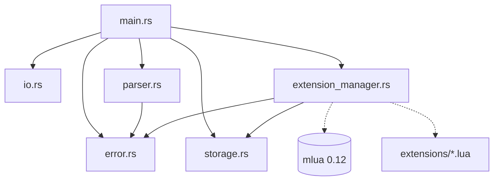

# EP 1 - Banco de Dados: Rust + Lua

Esse repositório contém o código de um banco de dados chave-valor em memória
escrito em **Rust**, com extensões/plugins em **Lua**.

O motor Rust é agnóstico a regras específicas. Todas as validações, formatações
e consultas adicionais de dados durante a execução são gerenciadas pelas extensões
contidas na pasta `extensions/`, carregadas dinamicamente na inicialização da
CLI.

## Integrantes

- Emanuelly Gomes
- Gabriel Frasão

## Como Compilar e Executar

### Requisitos

- [Rust](https://www.rust-lang.org/).

### Compilação

Na raiz do repositório, execute:

```bash
cargo build --release
```

O executável otimizado será gerado em `./target/release/banco-memoria`.

### Execução Interativa

Para abrir a interface interativa:

```bash
cargo run --release
```

Ou executando diretamente o binário compilado anteriormente:

```bash
./target/release/banco-memoria
```

**Exemplo de uso interativo:**

```text
$ ./target/release/banco-memoria
> ADD cpf_zezinho 12345678909
OK
> GET cpf_zezinho
123.456.789-09
> GET chave_inexistente
ERRO: chave inexistente
> EXIT
$
```

### Execução via _Pipe_

A CLI detecta se a entrada vem de um terminal interativo ou de um _pipe_.
Quando executado via _pipe_, o prompt `> ` é omitido, mas todas as respostas
(`OK`, valores consultados e mensagens de erro) continuam sendo emitidas,
encerrando o processo ao atingir o fim do arquivo (EOF):

```bash
cat lista-de-comandos.txt | ./target/release/banco-memoria
```

## Como Adicionar uma Extensão

O sistema descobre automaticamente as extensões no diretório `extensions/` na inicialização.

As extensões são simplesmente arquivos `.lua` que devem retornar uma tabela com
os seguintes campos:

```lua
return {
    -- Prefixo da chave que a extensão vai monitorar (opcional)
    -- Caso não seja informado, o nome do arquivo é usado por padrão + `_`
    -- ex: extensions/algumnome.lua -> prefixo = "algumnome_"
    prefix = "meuprefixo_",

    -- Função executada antes da operação no banco (opcional)
    pre_hook = function(ctx)
        -- ...
    end,

    -- Função executada após a operação no banco (opcional)
    post_hook = function(ctx)
        -- ...
    end,
}
```

### O Objeto de Contexto (`ctx`)

Tanto `pre_hook` quanto `post_hook` recebem um objeto de contexto (`ctx`), que
é uma tabela Lua com os seguintes campos e métodos:

| Campo / Método              | Tipo       | Mutável | Descrição                                                                                                                  |
| --------------------------- | ---------- | ------- | -------------------------------------------------------------------------------------------------------------------------- |
| `ctx.command`               | `string`   | ❌      | Nome do comando em execução (`"ADD"` ou `"GET"`).                                                                          |
| `ctx.key`                   | `string`   | ❌      | Chave fornecida pelo usuário na operação.                                                                                  |
| `ctx.value`                 | `string`   | ✅      | Valor passado pelo usuário para gravação (presente somente no `ADD`). Pode ser alterado pela extensão.                     |
| `ctx.result`                | `string`   | ✅      | Valor retornado do banco (presente no `GET`). Pode ser alterado pela extensão.                                             |
| `ctx.get(key)`              | `function` | ❌      | **Consulta por chave**: consulta o banco em tempo real e retorna o valor de `key` (ou `nil` se não existir).               |
| `ctx.get_key_by_value(val)` | `function` | ❌      | **Consulta reversa**: consulta o banco em tempo real e retorna a chave que contém o valor `val` (ou `nil` se não existir). |

### O que a aplicação Rust espera de volta

A extensão é livre para utilizar a mutabilidade dos campos como quiser (ex:
alterar o valor antes de ser persistido no banco, formatar ou transformar dados
antes de serem exibidos para o usuário etc.).

1. **Em caso de Sucesso**:
   - No `pre_hook`: O motor lê `ctx.value`. Se a extensão alterou esse campo, o
     novo valor é o que será de fato persistido no banco.
   - No `post_hook`: O motor lê `ctx.result`. Se alterado pela extensão, o novo
     valor é o que será exibido para o usuário na tela.
2. **Em caso de Erro**:
   - Se os dados forem inválidos ou uma regra de negócio for violada, a
     extensão deve invocar `error("motivo")`.
   - O motor Rust intercepta o erro do Lua, exibe na tela uma única linha no
     formato `ERRO: {motivo}` e a operação é abortada (ou seja, caso o erro
     seja disparado no `pre_hook`, nada é alterado no banco de dados).

## Consulta no Banco a partir da Extensão e Resolução de Concorrência no `ADD`

O enunciado do EP propõe o seguinte desafio:

> _"No instante em que a extensão faz a pergunta, o comando ADD já está no meio
> de uma operação sobre esse mesmo banco. Resolver isso é parte do exercício."_

A solução adotada se baseia em:

1. **Compartilhamento com Contagem de Referências e Empréstimo Interior**:
   - A instância única do [`Storage`](src/storage.rs) é envolvida em um `Rc<RefCell<Storage>>`.
   - Isso faz com que o Rust e as funções de callback registradas no Lua
     compartilhem o acesso ao mesmo banco sem copiar toda a base de dados.
2. **Separação Rígida de Fases (Validação -> Mutação)**:
   - **Fase 1 (Validação e Consulta - `trigger_pre_hook`)**: O comando `ADD` é
     recebido, mas o dado ainda não foi gravado. O `ExtensionManager` cria
     o contexto Lua injetando funções que utilizam empréstimo
     compartilhado. Quando a extensão de CPF invoca
     `ctx.get_key_by_value(ctx.value)`, ela consulta o banco sob demanda no
     estado imediatamente anterior à inserção.
   - **Fase 2 (Mutação - `storage.borrow_mut().add(key, value)`)**: Apenas se a
     extensão concluir a validação sem erros, o empréstimo de leitura é
     finalizado e o Rust adquire o empréstimo mutável exclusivo
     (`borrow_mut()`), persistindo os dados.
   - Se a validação do Lua falhar, a Fase 2 nunca é executada, garantindo
     integridade transacional sem violar o modelo de segurança de memória do Rust.

### Busca Reversa em $O(1)$

Para garantir que a consulta por valor exigida pela extensão do CPF não
se tornar $O(n)$ de acordo com o crescimento do banco, o `Storage` foi
projetado com um índice invertido:

```rust
pub struct Storage {
    data: HashMap<String, String>,                     // chave -> valor (O(1))
    value_to_keys: HashMap<String, HashSet<String>>,   // valor -> conjunto de chaves (O(1))
}
```

Isso permite a busca contante da chave de um valor no método
`get_key_by_value`, permitindo que vários registros compartilhem valores
iguais mantendo a verificação de unicidade em tempo constante.

## Extensão de Tema Livre: Manipulador de JSON (`json.lua`)

Além das extensões obrigatórias de CPF e Data, foi desenvolvida a extensão
[`extensions/json.lua`](extensions/json.lua) para o prefixo `json_`.

### O que ela faz

- **Inicialização / Sobrescrita no `ADD`**: Permite cadastrar objetos JSON
  planos (`{"campo": valor, ...}`) com suporte nativo aos tipos básicos do
  JSON:
  - Strings (ex.: `"Alice"`, `"Sao Paulo"`).
  - Números inteiros ou decimais (ex.: `30`, `-5.5`, `3.14`).
  - Booleanos (`true`, `false`).
- **Atualização Parcial Atômica e Idempotente (*Patching*) no `ADD`**:
  - `@campo=valor`: Atualiza ou define um campo específico no documento JSON (ex.: `ADD json_user @age=31`).
  - `+@campo=valor`: Adiciona ou define um campo de forma idempotente (ex.:
    `ADD json_user +@city="Sao Paulo"`). Se a chave ainda não existir no banco,
    inicializa o documento diretamente.
  - `-@campo`: Remove um campo existente de forma idempotente (ex.: `ADD
    json_user -@age`). Se o campo não existir (ou já tiver sido removido), a
    operação não gera erro e mantém o estado consistente.
- **Armazenamento Canônico**: O dado é persistido no banco em JSON minificado
  determinístico com chaves ordenadas alfabeticamente.
- **Formatação de Tabela no `GET`**: No `GET`, a extensão renderiza uma tabela ASCII formatada com colunas `CAMPO` e `VALOR`, bordas e chaves ordenadas:
  ```text
  +--------+-------------+
  | CAMPO  | VALOR       |
  +--------+-------------+
  | active | true        |
  | age    | 31          |
  | city   | "Sao Paulo" |
  | name   | "Alice"     |
  +--------+-------------+
  ```

### Diferencial Técnico (O que exercita de novo)

1. **Consulta sob Demanda com `ctx.get(ctx.key)` no `ADD`**: Para realizar o
   *patch* parcial, a extensão consulta o banco em tempo real durante a
   gravação para recuperar o estado anterior do documento, aplica a alteração
   em memória no Lua e persiste o novo JSON serializado. Diferente do CPF (que
   usa consulta reversa apenas para validação de unicidade), a extensão JSON
   usa a consulta direta para **mutação e composição de estado**.
2. **Manipulação Heterogênea de Tipos e Parser em Lua Puro**: Implementado
   inteiramente sem bibliotecas externas, realizando validação sintática,
   tipagem e serialização de estruturas compostas.
3. **Casos de Teste Dedicados**: Versionado no arquivo [`casos_teste_json.txt`](casos_teste_json.txt).

## Módulos do Projeto e Dependências

O único crate utilizado é o `mlua` e este é importado exclusivamente no módulo
responsável pelas extensões (`src/extension_manager.rs`). Nenhum outro módulo
tem conhecimento de que extensões em Lua existem.

### Módulos e Responsabilidades

- **[`src/main.rs`](src/main.rs)**: Ponto de entrada do executável. Inicializa
  o armazenamento e o gerenciador de extensões, executa o loop e despacha
  a execução dos comandos.
- **[`src/error.rs`](src/error.rs)**: Responsabilidade de tipagem e estruturação de erros.
  Define o enum `DatabaseError` e padroniza a formatação `ERRO: {motivo}` via trait `Display`.
- **[`src/io.rs`](src/io.rs)**: Responsabilidade de entrada e saída. Detecta terminais
  interativos, exibe prompts e formata as saídas de sucesso (`OK`), valores
  recuperados e mensagens de erro.
- **[`src/parser.rs`](src/parser.rs)**: Responsável pela interpretação dos
  comandos do usuário. Processa linhas de entrada de texto puro e as transforma
  no enum `Command` ou retorna erros sintáticos `DatabaseError::Syntax`.
- **[`src/storage.rs`](src/storage.rs)**: Armazenamento da aplicação.
  Gerencia o mapa de dados em memória e o índice secundário reverso
  `value_to_keys`.
- **[`src/extension_manager.rs`](src/extension_manager.rs)**: Responsabilidade
  da ponte com o Lua. Gerencia a VM do Lua, carrega dinamicamente as extensões
  do diretório `extensions/`, constrói os objetos de contexto e despacha os
  hooks `pre_hook` e `post_hook`.

### Diagrama de Dependências


